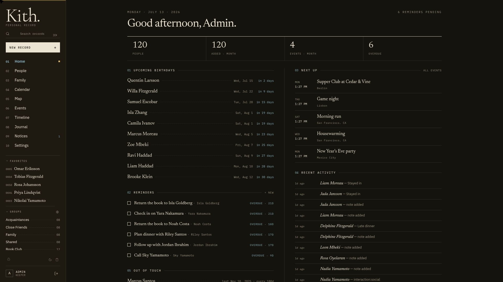
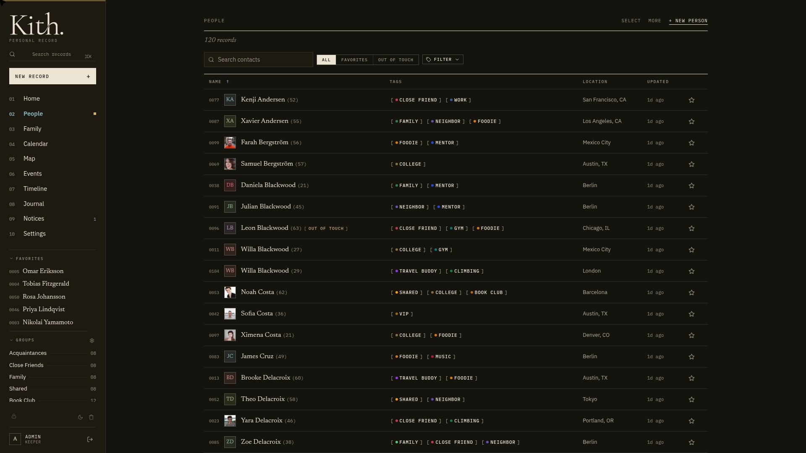
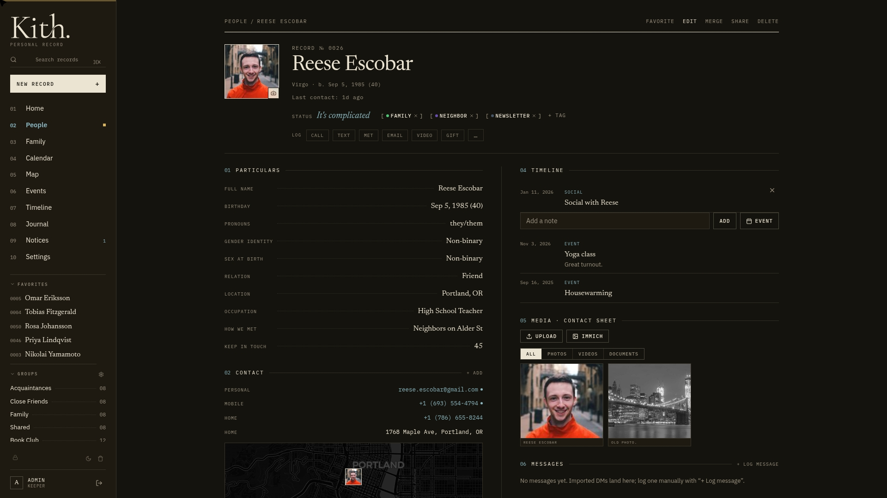
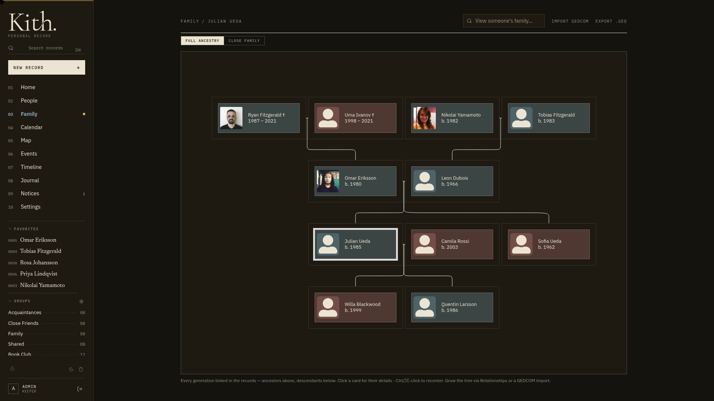
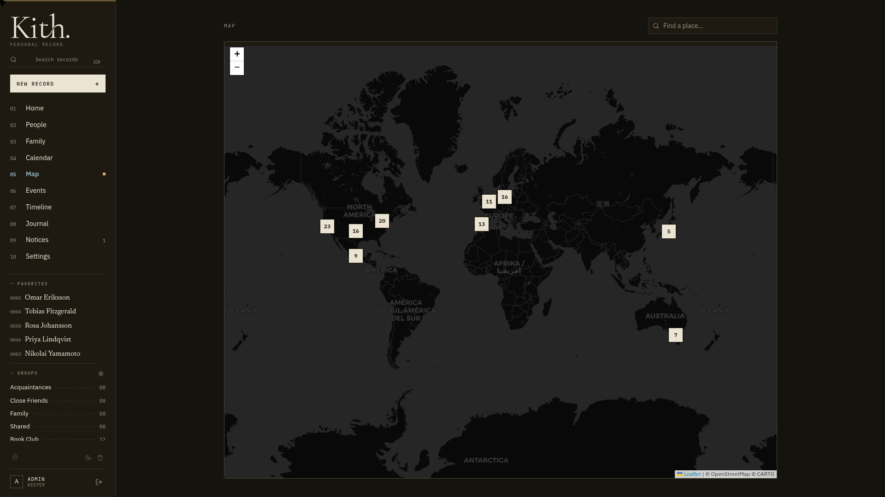
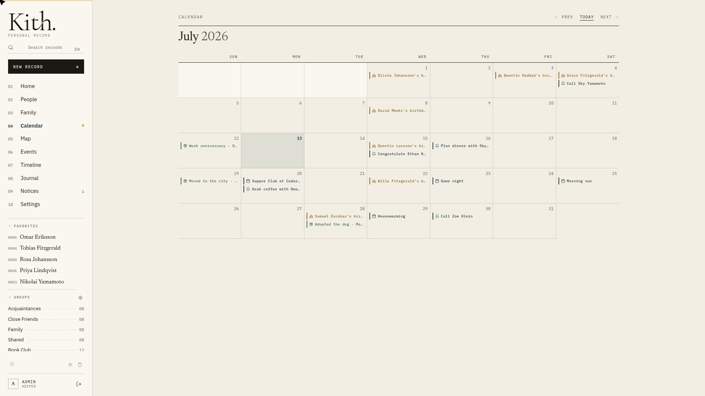
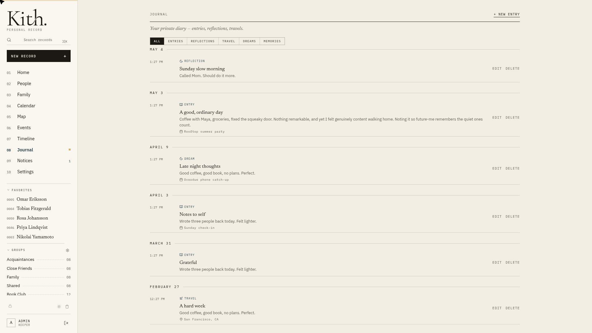
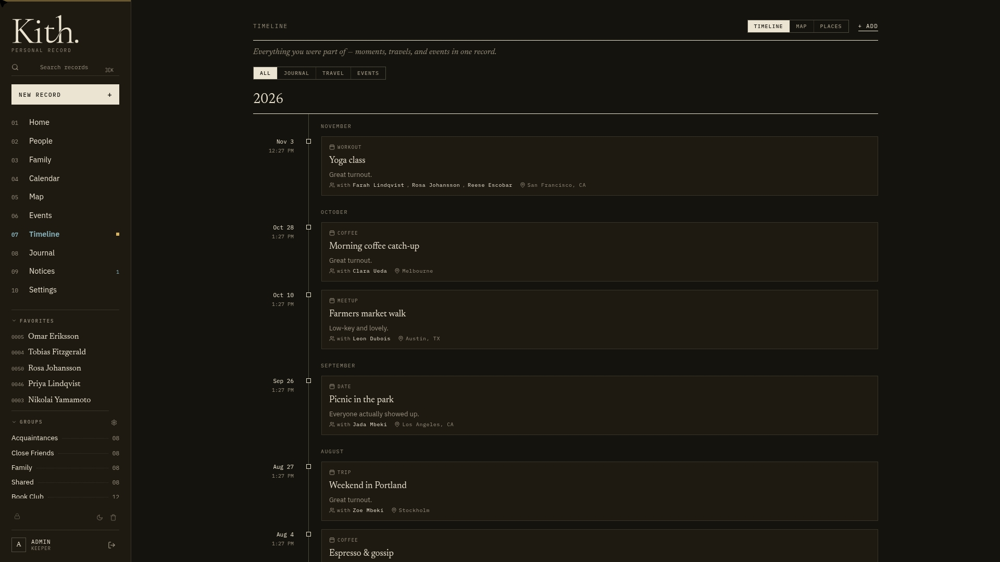
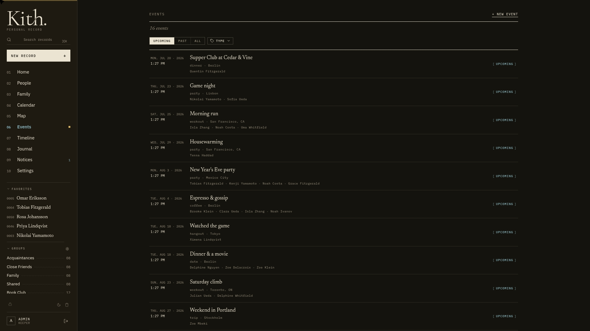

<p align="center">
  <picture>
    <source media="(prefers-color-scheme: dark)" srcset="docs/assets/wordmark-dark.png" />
    
  </picture>
</p>

<p align="center"><em>A self-hosted personal CRM for the relationships that matter.</em></p>

<p align="center">
  <a href="https://github.com/jaredguiles/kith/actions/workflows/ci.yml"></a>
  <a href="https://github.com/jaredguiles/kith/releases/latest"></a>
  <a href="https://github.com/jaredguiles/kith/pkgs/container/kith"></a>
  <a href="LICENSE"></a>
  = 24" />
  <a href="https://github.com/jaredguiles/kith/pulls"></a>
</p>

<p align="center">
  <a href="https://agtechlab.dev/kith/"><b>Website</b></a> ·
  <a href="https://agtechlab.dev/kith/features/"><b>Features</b></a> ·
  <a href="https://agtechlab.dev/kith/tour/"><b>Screenshot tour</b></a> ·
  <a href="https://agtechlab.dev/kith/docs/getting-started/"><b>Docs</b></a> ·
  <a href="API.md"><b>API reference</b></a>
</p>

---

Kith ("kith and kin") is a **personal** CRM — not networking, not sales
pipelines. It's for the actual humans in your life: their details,
interactions, events, journal entries, photos and videos, family
relationships, and an optional hidden **confidential** layer that is encrypted
at rest and invisible unless enabled.

<p align="center">
  
</p>

## Highlights

- **People-first** — rich contact profiles, relationships, an interactive family tree, groups, and favorites
- **A record of your life** — interactions, events, a calendar, a timeline, and a private journal
- **Media** — photo/video attachments with ffmpeg thumbnails, or browse an [Immich](https://immich.app) library
- **Map** — see where everyone is, with optional self-hosted geocoding via [Photon](https://github.com/komoot/photon)
- **Import** — vCard, CSV, and GEDCOM with a review step before anything is written
- **Confidential layer** — an opt-in, AES-256-GCM-encrypted hidden tier for data that needs an extra lock
- **Self-hosted & dependency-light** — Node.js + MariaDB, no frontend build step, no Redis, no external services
- **Light & dark themes** — an editorial paper/ink design system ("The Record", see [`DESIGN.md`](DESIGN.md))

## Screenshots

Light and dark variants of every view are in the
[full tour](https://agtechlab.dev/kith/tour/) — a sample:

| | |
|:---:|:---:|
|  <br/>**People** |  <br/>**Contact profile** |
|  <br/>**Family tree** |  <br/>**Map** |
|  <br/>**Calendar** (light) |  <br/>**Journal** (light) |
|  <br/>**Timeline** |  <br/>**Events** |

## Quick start

Try Kith in one command — the dev compose file includes a throwaway MariaDB,
so you don't need a database of your own:

```bash
git clone https://github.com/jaredguiles/kith.git && cd kith
docker compose -f docker-compose.yml -f docker-compose.dev.yml up --build
# → http://localhost:8084   (login: admin / changeme, forced password change on first login)
```

Or pull the prebuilt image for production:

```bash
docker pull ghcr.io/jaredguiles/kith:latest
```

## Stack

- **Node.js 24** (alpine) + **Express** — REST API + a static vanilla-JS SPA (no build step)
- **MariaDB** (external) — the database is the source of truth
- In-process `worker_threads` import processor (no queue/Redis needed)
- **ffmpeg** for video thumbnails
- **Docker** for deployment

Kith is intentionally lightweight: no frontend build pipeline, no message
broker, no external services beyond a MariaDB database. It runs behind any
reverse proxy (or none) and stores media on any mounted filesystem.

## Configuration

All configuration is via environment variables — copy
[`.env.example`](.env.example) to `.env` and fill it in. Nothing is hardcoded
to a particular host, domain, or storage path. Full reference:
[configuration docs](https://agtechlab.dev/kith/docs/configuration/).

**Required secrets** (the server refuses to start in `NODE_ENV=production` if
any is missing, a placeholder, or malformed):

| Variable | Purpose |
|---|---|
| `DB_PASSWORD` | MariaDB user password |
| `JWT_SECRET` | JWT signing key (≥ 32 chars) |
| `FIELD_ENCRYPTION_KEY` | **32-byte base64** AES-256-GCM key for the confidential layer — generate with `openssl rand -base64 32` |

> ⚠️ **Back up `FIELD_ENCRYPTION_KEY` separately from your database backups.**
> Losing it makes all encrypted confidential data permanently unrecoverable.
> Database dumps store confidential fields as ciphertext — restoring them
> requires the *same* key.

## Production deployment

1. Provision a `kith` database and user on your MariaDB server.
2. Set `DB_HOST`, `DB_PORT`, `DB_USER`, `DB_PASSWORD`, `DB_NAME`, and the three
   required secrets in the container's environment.
3. Point `MEDIA_PATH` at a mounted volume for photos/videos, and set `APP_URL`
   to your public URL.
4. `docker compose up -d` (using `ghcr.io/jaredguiles/kith`, or `--build` from source).
5. First boot creates the schema and a seed admin (`admin` / `changeme`) — log
   in, change the password, create users, and enable the confidential layer in
   Settings if you want it (it ships disabled).

Kith serves its own SPA and API on a single port; put it behind whatever
reverse proxy / TLS terminator you prefer, or expose it directly on a trusted
network. Its own JWT is the auth boundary, so an external SSO layer is
optional. Step-by-step guide:
[getting started](https://agtechlab.dev/kith/docs/getting-started/).

**Restore:** recreate the database from a dump, supply the **same**
`FIELD_ENCRYPTION_KEY`, and boot. Media lives on the `MEDIA_PATH` volume — back
that up at the storage layer.

## Optional integrations

Kith works fully standalone. A few features light up if you provide the
matching configuration (all optional, all off by default):

- **Self-hosted geocoding** — point `PHOTON_URL` at a [Photon](https://github.com/komoot/photon)
  instance to geocode addresses/events for the map. Without it, the map uses the
  bundled city-level dataset.
- **CardDAV/CalDAV push** — one-way sync of contacts + calendar to any DAV
  server (set `DAV_URL` / `DAV_USER` / `DAV_PASS`, enable with `DAV_SYNC_ENABLED`).
- **Immich** — browse and attach photos from an [Immich](https://immich.app)
  instance instead of uploading local files.
- **Email/notifications** — direct SMTP, or POST to a webhook for digests/nudges.

## Security model (summary)

- The app's JWT (an httpOnly, `SameSite=Strict` cookie) is the auth boundary.
- The confidential layer is server-side gated at multiple levels; confidential
  fields are AES-256-GCM encrypted at rest, and media is served only through
  authenticated routes.
- Set `BEHIND_TLS=false` when serving over plain HTTP (e.g. a LAN/IP-only
  instance) so cookies and CSP don't force HTTPS.

Details: [security docs](https://agtechlab.dev/kith/docs/security/). To report
a vulnerability, see [SECURITY.md](.github/SECURITY.md) — please don't open a
public issue.

## Documentation

All user documentation lives on the **[Kith site](https://agtechlab.dev/kith/)**
(the GitHub wiki is intentionally unused):

- [Getting started](https://agtechlab.dev/kith/docs/getting-started/)
- [Configuration reference](https://agtechlab.dev/kith/docs/configuration/)
- [Importing data](https://agtechlab.dev/kith/docs/importing/)
- [Security](https://agtechlab.dev/kith/docs/security/)
- [FAQ](https://agtechlab.dev/kith/docs/faq/)

In-repo developer references: [`SPEC.md`](SPEC.md) (functional spec),
[`API.md`](API.md) (REST API), [`DESIGN.md`](DESIGN.md) (visual system),
[`CHANGELOG.md`](CHANGELOG.md).

## Contributing

Bug reports, feature ideas, and PRs are welcome — see
[CONTRIBUTING.md](.github/CONTRIBUTING.md). Run the test suite with:

```bash
npm test
```

## License

[MIT](LICENSE) © Jared A Guiles-Haimes
